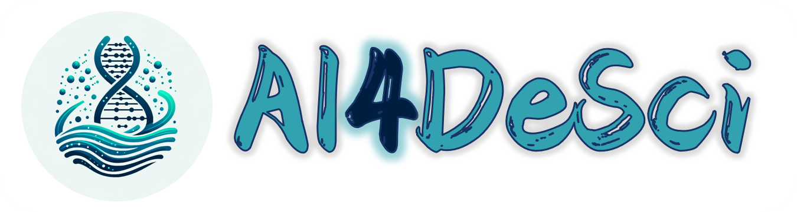

# AI4DeSci

<figure><figcaption>
AI4 DeSci Logo
</figcaption></figure>

Vision: Sustainable Infrastructure for AI-Empowered Open & Collaborative Decentralized Science

Mission:&#x20;

\[1] Build Infrastructure for Accelerating DeSci

\[2] Develop AI4DeSci Use-Cases with Scientific Impact

\[3] Promote DeSci Through Innovative Model and Actions&#x20;

Build Exclusively on Akash.network

<figure><figcaption>
Akash.network
</figcaption></figure>

\---------------------------------------------------------------------------------------------------------------------

AI4DeSci Ecosystem composed of 2 Core Platforms :&#x20;

\[A] DeSci Collaborative Cloud

\[B] Science Crowdsourcing

<figure><figcaption>
AI4DeSci Ecosystem Flywheel
</figcaption></figure>

Architecture

<figure><figcaption>
Current Architecture of AI4DeSci
</figcaption></figure>

Links:&#x20;

Website: ai4desci.com

Infra Overview: ai4desci.cloud

Documentation : docs.ai4desci.cloud

Collaborative Cloud : hub.ai4desci.com

Science Crowdsourcing: app.ai4desci.com&#x20;

1st Use case : app.plantamusica.cloud

To give a quick idea what its going to look like, currently it is composed of mainly two parts. First part is for **DeSci Cloud Collaboration**. Imagine Google Colab for Decentralized Science on Decentralized Cloud. Differing from the traditional Colab platform, here collaboration could be Human-Human, Human-AI-Agents, also between AI-Agents. Second Part is for **Science Crowdsourcing** to generate high-quality labelled data for AI, think about roboflow.com for annotation and labelling of DeSci & open-science related project data. Due to time restriction, most effort for use case and demonstration will be build for the above two main part. Marketplace will be a natural third component that will slowly follow through after the Hackathon. Template, tools, and auxiliary services will be what offered and traded/rented through the marketplace.
